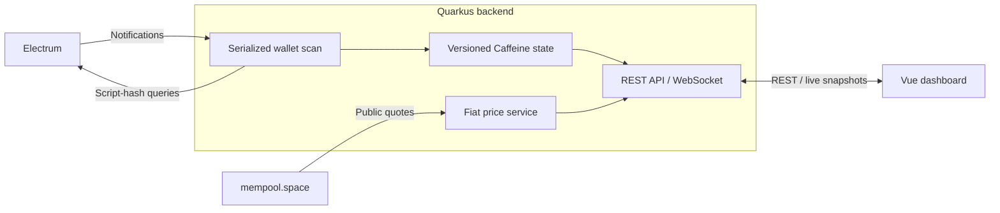

<p align="center"></p>

# ₿ Bitcoin Wallet Viewer


**A self-hosted, read-only Bitcoin dashboard powered by Electrum.** One extended public key, one application. No database, signing or spending.

[Features](#features) · [Architecture](#architecture) · [Stack](#stack) · [Docker](#docker) · [Configuration](#configuration) · [Logs](#logs) · [Security](#security-and-limitations)

> **Local by default, not authenticated.** Supply only an extended **public** key at runtime. Never provide a seed phrase or private key, or expose the API directly to the Internet.

## Features

- **Live wallet:** balances, confirmations, Activity / UTXO tabs, sorting and click-to-copy identifiers.
- **Transaction details:** expandable rows, fees and compact input/output graphs with independent pagination (five items per side).
- **Display units:** BTC, SAT, EUR and USD; switch beside the balance, with the preference saved locally.
- **Receive:** next address, derivation path and enlargeable QR code; BIP44, BIP49, BIP84 and BIP86 support.
- **Bitcoin dark theme:** responsive layout, keyboard controls and a live badge with Electrum server details.

## Architecture



- Addresses are derived locally; only script hashes reach Electrum, never the extended public key. Notifications trigger serialized scans, not periodic wallet polling.
- WebSocket pushes versioned snapshots; REST reads the same cache. Refresh replays cached data, and transaction details load on demand via Axios.
- State is in memory and rebuilt after restart. During outages, the UI keeps the last snapshot with a stale/offline warning. Fiat quotes come separately from [mempool.space](https://mempool.space/api/v1/prices), without wallet identifiers.

## Stack

| Component | Version / source |
| --- | --- |
| Java / Maven builder | Java **25**; Maven **3.9.12**, Eclipse Temurin 25 Docker build image |
| Backend | Quarkus **3.39.2**, Quinoa **2.9.0**, bitcoinj **0.16.3**, ZXing **3.5.3** — [pom.xml](pom.xml) |
| Reactive transport / cache | Vert.x, Mutiny and Caffeine — versions managed by the Quarkus BOM |
| Node.js | **24.20.0**, installed by Quinoa — [src/main/resources/application.properties](src/main/resources/application.properties) |
| Frontend (locked) | Vue **3.5.41**, TypeScript **5.9.3**, Vite **5.4.21**, Tailwind CSS **3.4.19** — [src/main/webui/package-lock.json](src/main/webui/package-lock.json) |
| UI libraries | Lucide Vue **1.43.0**, Axios **1.20.0** |
| Runtime image | Distroless Java **25**, Debian **13**, `nonroot` — [Dockerfile](Dockerfile) |

Versions reflect declarations and the npm lockfile. For local development, use JDK 25 and `mvn quarkus:dev`; Quinoa manages Node automatically.

## Docker

Requires Docker with Compose v2; no local Java, Maven or Node installation needed.

1. Copy [.env.example](.env.example) to a local environment file named **.env** and set `WALLET_XPUB` to your account-level extended public key. Keep it out of Git.
2. Match the script type and network to the account and Electrum server. **BIP86/Taproot requires `WALLET_SCRIPT_TYPE=p2tr`**: a plain xpub cannot identify Taproot automatically.
3. From the repository root, build/start, then open <http://localhost:8080>:

```sh
docker compose up -d --build
```

Follow logs or stop the service:

```sh
docker compose logs -f wallet-viewer
docker compose down
```

[compose.yaml](compose.yaml) binds to `127.0.0.1:8080`, enables Electrum TLS and runs non-root with a read-only filesystem and dropped capabilities. Change `WALLET_VIEWER_PORT` to use another host port.

**Use GHCR instead of building:** set `WALLET_VIEWER_IMAGE=ghcr.io/<owner>/<repository>:latest` in your local environment file, using the lowercase repository path, then:

```sh
docker compose pull
docker compose up -d --no-build
```

Prefer a release tag or digest; private GHCR images require authentication. The [Docker workflow](.github/workflows/docker.yml) runs Java/frontend tests, TypeScript checks and a **linux/amd64** build on PRs; `main` and `v*` pushes publish images without deploying them.

## Dependency updates

[Renovate](renovate.json) opens separate **Java**, **Frontend** and **Docker** PRs, with major upgrades separated and **no automerge**. Node settings stay synchronized; Docker digests track image rebuilds. JDK/image-family migrations remain manual.

Authorize the [Renovate app](https://github.com/apps/renovate) for the repository and publish the configuration on the default branch. In the [Mend portal](https://developer.mend.io/github/comassky/wallet-viewer), disable **Silent mode** to enable automatic PR creation. npm uses the public registry; no corporate credentials are needed.

## Configuration

Supply wallet settings **at runtime**, never as build arguments or in source. Defaults below are for Compose; application-only differences are noted.

| Variable | Default | Purpose |
| --- | --- | --- |
| `WALLET_XPUB` | Required | Account-level extended public key, not a master key or single address |
| `WALLET_SCRIPT_TYPE` | `auto` | `auto`, `p2pkh`, `p2sh-p2wpkh`, `p2wpkh`, `p2tr`; explicitly select `p2tr` for BIP86 |
| `WALLET_NETWORK` | `mainnet` | `mainnet` or `testnet`; use a compatible Electrum server on the same network |
| `WALLET_GAP_LIMIT` | `20` | Consecutive unused addresses stopping discovery on each chain |
| `WALLET_MAX_ADDRESSES` | `200` | Maximum history-scanned addresses per receive/change chain |
| `ELECTRUM_HOST` | `electrum.blockstream.info` | Reachable Electrum hostname; the default targets mainnet |
| `ELECTRUM_PORT` | `50002` | Server port; application-only default is `50001` |
| `ELECTRUM_SSL` | `true` | TLS with certificate/hostname verification; application-only default is `false` |
| `ELECTRUM_REQUEST_TIMEOUT` | `30s` | Per-RPC timeout |

Inside Docker, `localhost` means the container: use a reachable server hostname. Compose forwards only declared variables and does not mount local Java configuration.

## Logs

- **INFO:** Electrum connections, address notifications, scan results and new transaction counts.
- **DEBUG:** RPC method, request ID, duration and outcome; no keys, balances or raw payloads. Enable the `com.example.walletviewer` category via [Quarkus logging configuration](https://quarkus.io/guides/logging).

**Logs contain wallet addresses:** keep them private and redact them before sharing.

## Security and limitations

- **No authentication:** keep access local or use an authenticated HTTPS proxy with WebSocket support, preserved `Host`/`Origin` headers and timeouts above 90 seconds. Origin checks are not access control.
- **Privacy:** public keys expose account history; Electrum can correlate scripts. Use a trusted server and never provide spending secrets.
- **Bounded discovery:** funds beyond the gap/address limits may be missed. An extra receive address beyond the cap is watched without history; raise `WALLET_MAX_ADDRESSES` before relying on its balance.
- **Estimates:** missing parent transactions prevent fee calculation; graph edges do not allocate inputs to outputs. Fiat uses current quotes, not historical prices.