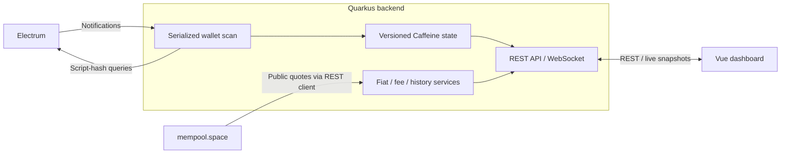

<p align="center"></p>

# ₿ Bitcoin Wallet Viewer

<p align="center">
  
  
  
  
  
  
  
  
  
  
</p>

**A self-hosted, read-only Bitcoin dashboard powered by Electrum.** One extended public key, one application. No database, signing or spending.

> [!WARNING]
> **No built-in authentication.** This application ships no login or access control of its own. Never expose it directly to the internet — always place it behind a secure, authenticated reverse proxy (HTTPS, with WebSocket support, preserved `Host`/`Origin` headers and timeouts above 90s). The built-in origin checks are hardening, not access control.
>
> 🔒 Supply only an extended **public** key at runtime. Never provide a seed phrase or private key, or expose the API directly to the Internet.

### Why I built this

Like many people, I run an Electrum node that I deliberately keep **off the public internet**. I just wanted to check my wallet and balance from anywhere — without the usual trade-offs:

- 🚫 **No VPN** to tunnel back home.
- 🔒 **No public key** pasted into third-party websites.

**Wallet Viewer does exactly that:** point it at your own Electrum server, feed it a watch-only xpub, and get a dashboard you fully host and control.

### Why you'll love it

- 🛡️ **Watch, never touch.** The app only ever sees a public key — nothing to sign, nothing to spend, nothing to steal.
- 🚀 **Up in one command.** A single self-contained container. No database, no accounts, no background jobs to babysit.
- ⚡ **Truly live.** Electrum notifications stream balance and transaction updates the instant they land — no refresh, no polling.
- 🔎 **See everything.** Fees, UTXOs, input/output graphs and derivation paths in a fast, responsive Bitcoin-orange dark UI.
- 🕵️ **Your node, your privacy.** Point it at your own Electrum server; only script hashes ever leave home, never your xpub.

[Features](#features) · [Architecture](#architecture) · [Stack](#stack) · [Docker](#docker) · [Demo](#demo-mode) · [Configuration](#configuration) · [Logs](#logs) · [Security](#security-and-limitations) · [License](#license)

<div align="center">

### 🧪 DEMO SCREENSHOTS ONLY

**The wallet, balance, addresses and transactions below are _entirely synthetic_.**<br>
**This wallet does NOT exist and holds NO REAL FUNDS.**<br>
**Nothing shown here corresponds to any real Bitcoin wallet, address or transaction.**

_Screenshots from [demo mode](#demo-mode)._

</div>

<p align="center"></p>

<p align="center"></p>

<p align="center"></p>

## Features

- 💰 **Live wallet:** balances, confirmations, Activity / UTXO tabs, sorting and click-to-copy identifiers.
- 🔍 **Transaction details:** a full-width dialog with **Graph** and **Inputs / Outputs** tabs, fees and compact input/output graphs with independent pagination (five items per side).
- 📈 **Balance history:** an interactive balance-over-time chart (lightweight-charts) with an optional fiat-value curve, selectable periods and per-curve visibility saved locally, plus a live mempool fee gauge in the header.
- 💱 **Display units:** BTC, SAT, EUR and USD; switch beside the balance, with the preference saved locally.
- 📥 **Receive:** next address, derivation path and enlargeable QR code; BIP44, BIP49, BIP84 and BIP86 support.
- 🎨 **Bitcoin dark theme:** responsive layout, keyboard controls and a live badge with Electrum server details.

## Architecture



- Addresses are derived locally; only script hashes reach Electrum, never the extended public key. Notifications trigger serialized scans, not periodic wallet polling.
- WebSocket pushes versioned snapshots; REST reads the same cache. Refresh replays cached data, and transaction details load on demand via Axios.
- State is in memory and rebuilt after restart. During outages, the UI keeps the last snapshot with a stale/offline warning. Fiat quotes, fee estimates and price history come separately from [mempool.space](https://mempool.space/api/v1/prices), fetched by a declarative reactive REST client (MicroProfile REST Client) and shared/cached per TTL, without wallet identifiers.

## Stack

| Component | Version / source |
| --- | --- |
| Java / Maven builder | Java **25**; Maven **3.9.16**, Eclipse Temurin 25 Docker build image |
| Backend | Quarkus **3.39.3**, SmallRye OpenAPI, Quinoa **2.9.0**, bitcoinj **0.17.1** (QR codes via a vendored, dependency-free encoder) — [pom.xml](pom.xml) |
| Reactive transport / cache | Vert.x (TCP client for Electrum), MicroProfile REST Client (mempool.space), Mutiny and Caffeine — versions managed by the Quarkus BOM |
| Node.js | **24.21.0**, installed by Quinoa — [src/main/resources/application.properties](src/main/resources/application.properties) |
| Frontend (locked) | Vue **3.5.42**, Vite **8.3.0**, @vitejs/plugin-vue **6.0.8**, vue-tsc **3.3.11**, TypeScript **5.9.3**, Tailwind CSS **4.3.3** (via @tailwindcss/vite), @types/node **22.20.2** — [src/main/webui/package-lock.json](src/main/webui/package-lock.json) |
| UI libraries | Material Design Icons (@mdi/js) **7.4.47**, Axios **1.20.0**, @formkit/auto-animate **0.10.0**, lightweight-charts **5.2.1** |
| Runtime image | Distroless Java **25**, Debian **13**, `nonroot` — [Dockerfile](Dockerfile) |

Versions reflect declarations and the npm lockfile. For local development, use JDK 25 and `mvn quarkus:dev`; Quinoa manages Node automatically.

## Docker

Requires Docker with Compose v2 — no local Java, Maven or Node needed.

1. Copy [.env.example](.env.example) to **.env** and set `WALLET_XPUB` to your account-level extended public key (keep it out of Git).
2. Build, start, then open <http://localhost:8080>:

```sh
docker compose up -d --build
```

See **[Docker & deployment](docs/DOCKER.md)** for GHCR images, script-type/network options, security hardening, custom ports and releases.

## Demo mode

Set **`WALLET_DEMO=true`** (in your `.env`) for a no-setup demo with synthetic data — ideal for screenshots and UI previews without exposing a real xpub, address or transaction:

```sh
docker compose up -d --build   # with WALLET_DEMO=true in .env
```

In demo mode the app never connects to Electrum. It serves a self-consistent synthetic wallet (balance, UTXOs, transactions and a derived receive address) from a bundled public test key, and the mock **emits a random transaction every 15 seconds** so the live view keeps updating. `WALLET_XPUB` and the Electrum settings are ignored — no real funds or identity are involved.

## Configuration

Supply wallet settings **at runtime**, never as build arguments or in source. Defaults below are for Compose; application-only differences are noted.

| Variable | Default | Purpose |
| --- | --- | --- |
| `WALLET_DEMO` | `false` | Serve a synthetic demo wallet with no Electrum or xpub; the mock emits a random transaction every 15s. See [Demo mode](#demo-mode) |
| `WALLET_XPUB` | Required unless demo | Account-level extended public key, not a master key or single address |
| `WALLET_SCRIPT_TYPE` | `auto` | `auto`, `p2pkh`, `p2sh-p2wpkh`, `p2wpkh`, `p2tr`; explicitly select `p2tr` for BIP86 |
| `WALLET_NETWORK` | `mainnet` | `mainnet` or `testnet`; use a compatible Electrum server on the same network |
| `WALLET_GAP_LIMIT` | `20` | Consecutive unused addresses stopping discovery on each chain |
| `WALLET_MAX_ADDRESSES` | `200` | Maximum history-scanned addresses per receive/change chain |
| `ELECTRUM_HOST` | `electrum.blockstream.info` | Reachable Electrum hostname; the default targets mainnet |
| `ELECTRUM_PORT` | `50002` | Server port; application-only default is `50001` |
| `ELECTRUM_SSL` | `true` | TLS with certificate/hostname verification; application-only default is `false` |
| `ELECTRUM_REQUEST_TIMEOUT` | `30s` | Per-RPC timeout |
| `LOG_LEVEL` | `INFO` | Application log level for the `com.comassky.wallet` category; set `DEBUG` for Electrum/scan lifecycle logs |

Inside Docker, `localhost` means the container: use a reachable server hostname. Compose forwards only declared variables and does not mount local Java configuration.

## API

The REST API is documented with OpenAPI 3.1.

- **Hosted docs (ReDoc):** https://comassky.github.io/wallet-viewer/ (published on each release).
- **Swagger UI (running app):** `/q/swagger-ui`
- **OpenAPI spec (running app):** `/q/openapi` (add `?format=json` for JSON).

## Logs

Control verbosity with **`LOG_LEVEL`** (default `INFO`; set `DEBUG` for Electrum connection, notification and scan-lifecycle logs). See **[Logging](docs/LOGS.md)** for levels and privacy details.

**⚠️ Logs contain wallet addresses:** keep them private and redact them before sharing.

## Security and limitations

- 🔓 **No authentication:** keep access local or use an authenticated HTTPS proxy with WebSocket support, preserved `Host`/`Origin` headers and timeouts above 90 seconds. Origin checks are not access control.
- 🕵️ **Privacy:** public keys expose account history; Electrum can correlate scripts. Use a trusted server and never provide spending secrets.
- 🎯 **Bounded discovery:** funds beyond the gap/address limits may be missed. An extra receive address beyond the cap is watched without history; raise `WALLET_MAX_ADDRESSES` before relying on its balance.
- 📊 **Estimates:** missing parent transactions prevent fee calculation; graph edges do not allocate inputs to outputs. Fiat on balances and transactions uses current quotes; only the balance-history chart values each day at its historical price.

## License

Released under the [GNU General Public License v3.0](LICENSE).
