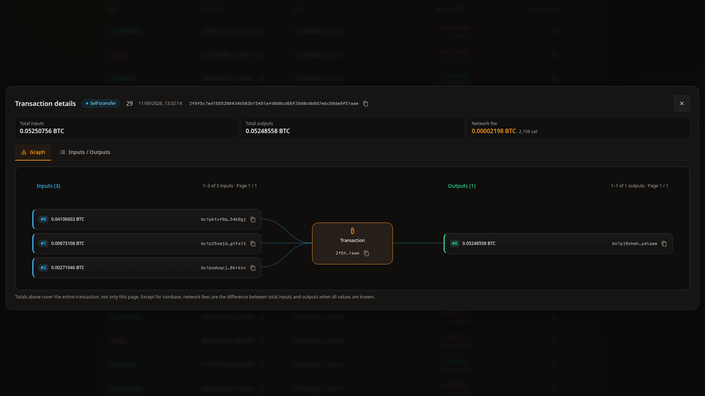
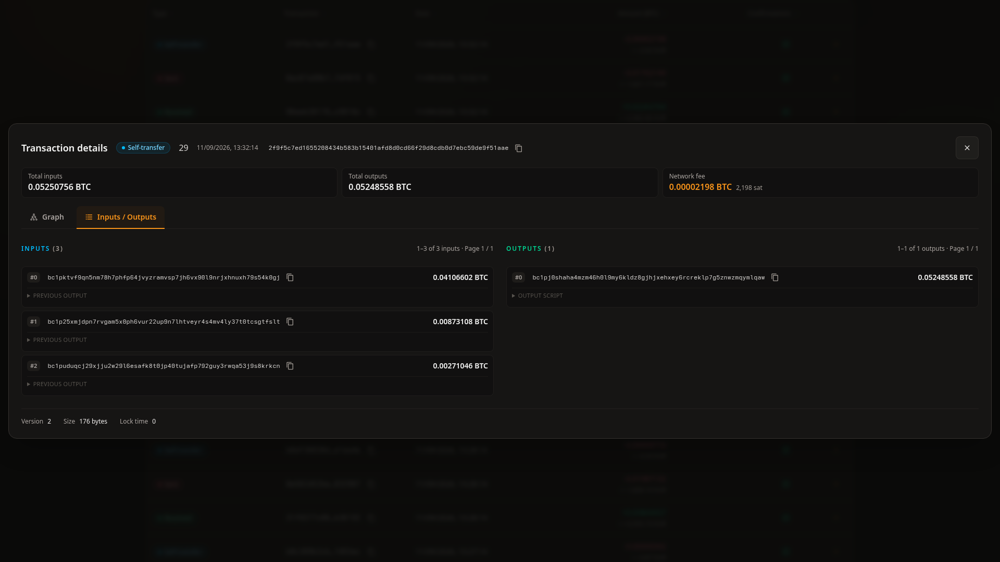
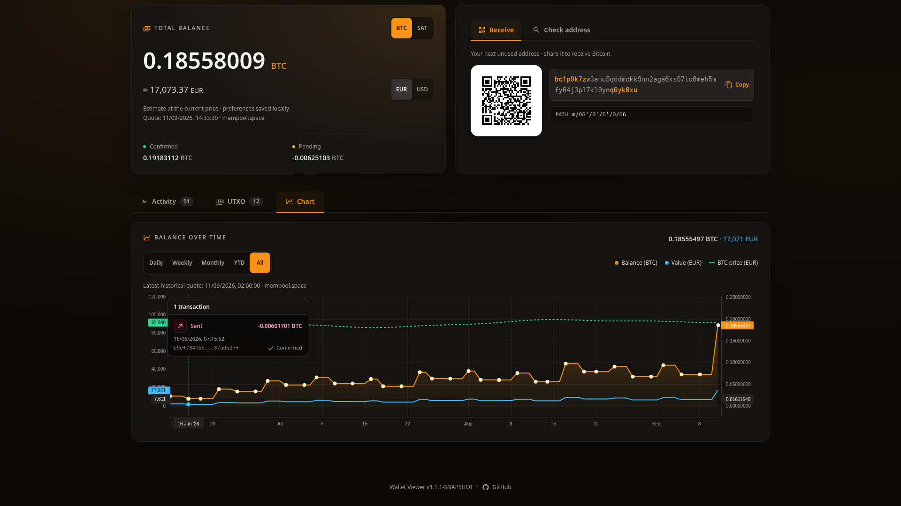
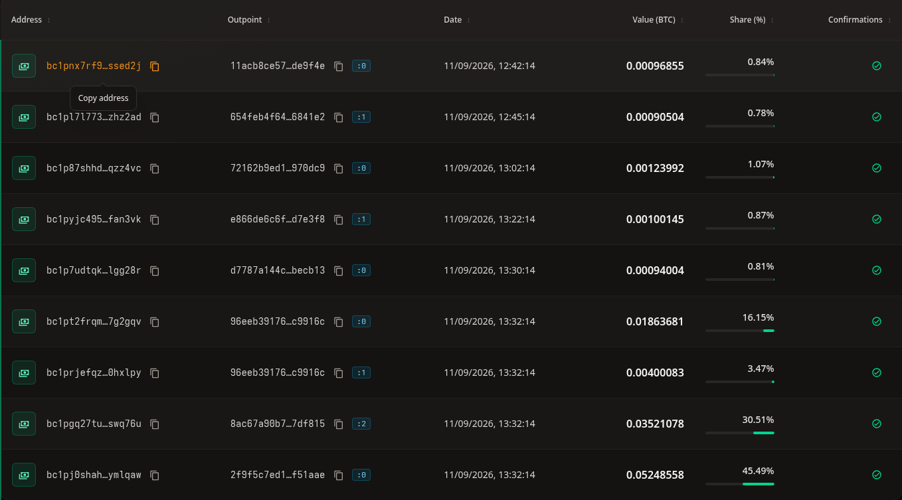
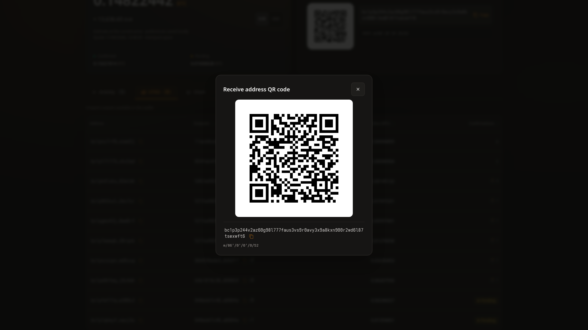
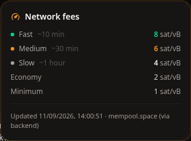

<p align="center"></p>

# ₿ Bitcoin Wallet Viewer

<p align="center">
	
	
	
	
	
</p>

**A self-hosted, read-only Bitcoin dashboard powered by Electrum.** One extended public key, one application. No database, signing or spending.

> [!WARNING]
> **No built-in authentication.** Keep the app local or behind an authenticated HTTPS reverse proxy. Never expose the app or API directly to the internet, and never supply a seed phrase or private key. See [Security and limitations](#security-and-limitations).

### Why I built this

I wanted to check my wallet remotely while keeping my Electrum node off the public internet and my xpub out of third-party dashboards. Wallet Viewer provides a watch-only interface that I host behind my own authenticated proxy.

[Quick start](#docker) · [Features](#features) · [Demo](#demo-mode) · [Configuration](#configuration) · [Documentation](#documentation) · [Development](#development) · [Security](#security-and-limitations)

> [!NOTE]
> Screenshots use a synthetic demo wallet, with no real funds. Fee estimates, EUR/USD quotes and historical fiat values are mocked, not live market data.

<p align="center"></p>

<details>
<summary>More Desktop Screenshots</summary>

Click a thumbnail to open the full image. See [Refresh README screenshots](docs/DEMO.md#refresh-readme-screenshots) to regenerate them in headless Chrome.

<p align="center">
	<a href="docs/balance-history.png" title="Balance and price history"></a>
	<a href="docs/transaction.png" title="Transaction details"></a>
	<a href="docs/consolidation.png" title="Internal consolidation"></a>
	<a href="docs/inputs-outputs.png" title="Inputs and outputs"></a>
	<a href="docs/chart-transaction.png" title="Chart transaction summary"></a>
	<a href="docs/utxos.png" title="Unspent outputs"></a>
	<a href="docs/receive.png" title="Receive address"></a>
	<a href="docs/network-fees.png" title="Network fee estimates"></a>
</p>

</details>

## Docker

Requires Docker with Compose v2. From a checkout of this repository, copy [.env.example](.env.example) to `.env` and set your account-level `WALLET_XPUB`, Electrum server and network. For BIP86/Taproot, set `WALLET_SCRIPT_TYPE=p2tr` explicitly. Keep `.env` out of Git.

### Run the published native image

No local Java, Maven or Node installation is needed. Set this in `.env`:

```dotenv
WALLET_VIEWER_IMAGE=ghcr.io/comassky/wallet-viewer:latest
```

Then pull and start the image without building:

```sh
docker compose pull
docker compose up -d --no-build
```

Published images target `linux/amd64`. Prefer a fixed release tag or digest for repeatable deployments; see [Docker & deployment](docs/DOCKER.md).

### Build the JVM image from source

Leave `WALLET_VIEWER_IMAGE` unset in `.env`, then:

```sh
docker compose up -d --build
```

This uses [Dockerfile](Dockerfile) and includes a JVM; it is not a native build. For a local native build, follow the [native image guide](docs/DOCKER.md#native-image-graalvm).

Both paths serve the app at <http://localhost:8080>, bound to loopback by default. Follow logs with `docker compose logs -f wallet-viewer`; stop with `docker compose down`.

## Features

- **Watch-only:** derives addresses locally from an account-level public key. No private keys, signing or spending.
- **Live activity:** Electrum notifications update balances, transactions and UTXOs, with search, sorting and explicit stale/reconnecting states.
- **Transaction details:** received, sent and self-transfer labels, input/output graphs, paginated details and transaction fees.
- **Balance history:** Bitcoin balance, optional portfolio value and BTC price curves, transaction markers and selectable periods. Curve visibility is remembered.
- **Units and quotes:** independent BTC/SAT and EUR/USD selectors, browser-localized amounts and network fee estimates. Missing market data does not hide Bitcoin balances.
- **Receive:** next address, derivation path and enlargeable SVG QR code; BIP44, BIP49, BIP84 and BIP86 support.
- **Responsive interface:** desktop tables, mobile layouts, keyboard navigation and an amount-hiding preference.

## Demo mode

Set **`WALLET_DEMO=true`** for a synthetic wallet with varied transactions and evolving confirmations, without an Electrum connection. Remove real wallet overrides before sharing screenshots.

See the **[Demo mode guide](docs/DEMO.md)** for setup, simulation behaviour and privacy precautions, or [regenerate the screenshots](docs/DEMO.md#refresh-readme-screenshots).

## Configuration

Supply wallet settings **at runtime**, never as build arguments or in source. Defaults below are for Compose; application-only differences are noted.

| Variable | Default | Purpose |
| --- | --- | --- |
| `WALLET_DEMO` | `false` | Synthetic wallet without Electrum; events every 15s and simulated blocks every 60s. See [Demo mode](docs/DEMO.md) |
| `WALLET_XPUB` | Required unless demo | Account-level extended public key, not a master key or single address |
| `WALLET_SCRIPT_TYPE` | `auto` | `auto`, `p2pkh`, `p2sh-p2wpkh`, `p2wpkh`, `p2tr`; explicitly select `p2tr` for BIP86 |
| `WALLET_NETWORK` | `mainnet` | `mainnet` or `testnet`; use a compatible Electrum server on the same network |
| `WALLET_GAP_LIMIT` | `20` | Consecutive unused addresses stopping discovery on each chain |
| `WALLET_MAX_ADDRESSES` | `200` | Maximum history-scanned addresses per receive/change chain |
| `WALLET_RPC_CONCURRENCY` | `8` | Maximum concurrent RPCs per scan group; up to four groups run together (balance, UTXOs, headers, transactions), not a global transport limit |
| `ELECTRUM_HOST` | `electrum.blockstream.info` | Reachable Electrum hostname; the default targets mainnet |
| `ELECTRUM_PORT` | `50002` | Server port; application-only default is `50001` |
| `ELECTRUM_SSL` | `true` | TLS with certificate/hostname verification; application-only default is `false` |
| `ELECTRUM_REQUEST_TIMEOUT` | `30s` | Per-RPC timeout |
| `LOG_LEVEL` | `INFO` | Application log level for the `com.comassky.wallet` category; set `DEBUG` for Electrum/scan lifecycle logs |

Inside Docker, `localhost` means the container: use a reachable server hostname. Compose forwards only declared variables and does not mount local Java configuration.

## Documentation

| Guide | Contents |
| --- | --- |
| [Docker & deployment](docs/DOCKER.md) | Published images, native/JVM builds, runtime trade-offs and releases |
| [Demo mode](docs/DEMO.md) | Synthetic ledger, privacy precautions and screenshot generation |
| [Development](docs/DEVELOPMENT.md) | Setup, tests, stack, architecture and API contracts |
| [Logging](docs/LOGS.md) | Log levels, diagnostics and redaction |

### API

[Hosted API reference](https://comassky.github.io/wallet-viewer/) is updated on releases. A running app exposes OpenAPI at `/q/openapi` (`?format=json` for JSON); Swagger UI is available only in development at `/q/swagger-ui`.

Use `/api/wallet/state` when snapshot freshness matters. See [API contracts](docs/DEVELOPMENT.md#api-contracts) for cache, discovery and nullable historical price fields.

## Logs

Control verbosity with **`LOG_LEVEL`** (default `INFO`; set `DEBUG` for Electrum connection, notification and scan-lifecycle logs). See **[Logging](docs/LOGS.md)** for levels and privacy details.

**Logs can contain wallet addresses:** keep them private and redact them before sharing.

## Development

Use JDK 25 and Maven. Configure a wallet at runtime, or use a demo instance without real wallet overrides:

```sh
WALLET_DEMO=true mvn quarkus:dev
```

Quinoa installs Node and starts the frontend. Open <http://localhost:8080>. Use a current browser with native `toSorted()` and `Map.groupBy()` support; older browsers are not supported.

Run `mvn verify` for the JVM build and tests. For frontend-only tests, type checking and the production build, run `npm ci` followed by `npm run build` in `src/main/webui`. See [Development](docs/DEVELOPMENT.md) for tooling, architecture and native integration tests.

## Security and limitations

- **No authentication:** keep access local or use an authenticated HTTPS proxy with WebSocket support, preserved `Host`/`Origin` headers and timeouts above 90 seconds. Origin checks are not access control.
- **Privacy:** an xpub exposes account history, even though it cannot authorize spending. The xpub stays in this application; Electrum receives script hashes and transaction IDs and can correlate requests. Use a trusted server. Public market-data requests go to mempool.space without wallet identifiers.
- **Hide amounts:** replaces displayed wallet amounts, including dialogue values, with a neutral label and clears the history chart. Notifications never include amounts. This is a display preference, not access control: identifiers and API data remain available to authorized users of the browser.
- **Bounded discovery:** funds beyond the gap/address limits may be missed. An extra receive address beyond the cap is watched without history; raise `WALLET_MAX_ADDRESSES` before relying on its balance.
- **Estimates:** missing parent transactions prevent fee calculation; graph edges do not allocate inputs to outputs. Fiat on balances and transactions uses current quotes; only the balance-history chart values each day at its historical price.

## License

Released under the [GNU General Public License v3.0](LICENSE).
