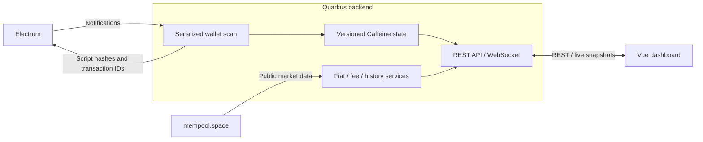

# Development

[Back to README](../README.md#development)

## Local Setup

Use JDK 25 and Maven. Wallet settings belong in the runtime environment, not source or build arguments. For a demo without real wallet overrides, run from the repository root:

```sh
WALLET_DEMO=true mvn quarkus:dev
```

Quinoa installs the configured Node version and starts the Vite frontend. Open <http://localhost:8080>. See [Demo mode](DEMO.md) for the test key, simulation and privacy precautions; explicit wallet environment variables can override demo defaults.

For standalone frontend development, start the backend on port 8080, then run from `src/main/webui`:

```sh
npm ci
npm run dev
```

Vite proxies `/api` and WebSocket requests to port 8080. To avoid starting a second frontend through Quinoa, launch the backend with `-Dquarkus.quinoa=false`. Use Node 24 for standalone frontend commands, matching the major version managed by Quinoa.

## Tests And Builds

From the repository root:

```sh
mvn verify
```

This builds the application and runs unit and packaged JVM integration tests. The live-wallet integration fixture is loopback-only and covers REST/WebSocket consistency, credit notifications, cache replay, reconnection and origin rejection without querying a real wallet.

From `src/main/webui`:

```sh
npm test
npm run typecheck
npm run build
```

`npm run build` runs the tests and type check before Vite's production build, so the first two commands are useful for narrower checks. Tests use Node's test runner with `tsx`; source imports use `@/` in Vue, TypeScript and tests. Vite and TypeScript map `@/` to `src/`, and `tsx` reads the same TypeScript paths for Node execution. Filesystem paths used to read fixtures are not module imports.

For native compilation and packaged native integration tests, see [Native image](DOCKER.md#native-image-graalvm). Screenshot tooling and browser installation are documented under [Refresh README screenshots](DEMO.md#refresh-readme-screenshots).

## Stack

| Component | Version / source |
| --- | --- |
| Java / Maven builder | Java 25; Maven 3.9.16 in the Eclipse Temurin Docker build image |
| Backend | Quarkus 3.39.3, SmallRye OpenAPI, Quinoa 2.9.0, bitcoinj 0.17.1; see [pom.xml](../pom.xml) |
| Reactive transport / cache | Vert.x, MicroProfile REST Client, Mutiny and Caffeine; versions managed by the Quarkus BOM |
| Managed Node.js | 24.21.0; see [application.properties](../src/main/resources/application.properties) |
| Frontend | Vue 3.5, Vite 8, TypeScript 5.9, Tailwind CSS 4; exact versions in [package-lock.json](../src/main/webui/package-lock.json) |
| UI libraries | Material Design Icons, auto-animate and lightweight-charts; see [package.json](../src/main/webui/package.json) |
| Test / capture tools | Node test runner with tsx, vue-tsc and Playwright |
| Runtime images | Native on Distroless Debian 13; JVM on Distroless Java 25, both non-root. See [runtime comparison](DOCKER.md#native-vs-jvm) |

Vite targets `esnext`: use a current browser with native `toSorted()` and `Map.groupBy()`. There is no legacy-browser fallback or polyfill. TypeScript enables `strict`, `noUncheckedIndexedAccess`, `exactOptionalPropertyTypes`, `verbatimModuleSyntax` and `erasableSyntaxOnly`.

## Architecture



Addresses are derived locally; the extended public key is not sent to Electrum. Script hashes and transaction IDs are sent for wallet queries and transaction retrieval. Notifications trigger serialized scans, not periodic wallet polling. Public price, fee and history requests go separately to mempool.space without wallet identifiers.

State is in memory and rebuilt after restart. WebSocket pushes versioned snapshots; REST reads the same cache. Refresh replays cached data. During outages, the UI retains the last snapshot with a stale/offline warning. Transaction details load on demand.

### Backend

Electrum RPC responses are decoded into validated records. Malformed or missing values fail the scan instead of becoming zero balances. Wallet and Electrum settings use validated SmallRye `@ConfigMapping` interfaces. Derivation data uses immutable `AddressInfo` records, hexadecimal conversion uses Java `HexFormat`, and business timestamps use an injectable UTC `Clock`; elapsed-time deadlines remain monotonic.

Quarkus WebSockets Next keeps isolated per-connection state with at most one pending snapshot, a 10-second send deadline, 30-second pings and a 90-second pong timeout. HTTP upgrade rejects missing, ambiguous or foreign origins with 403. WebSocket traffic logging and Dev UI message retention are disabled. Origin checks are not authentication.

Receive QR codes are SVG, generated by an embedded encoder adapted from [Project Nayuki's QR-Code-generator](https://www.nayuki.io/page/qr-code-generator-library), MIT. An address's QR is immutable and memoized in a bounded cache.

### Frontend

REST and WebSocket payloads are validated before entering Vue state. Snapshot state uses `shallowRef` and is replaced as a whole. Template references use Vue 3.5 `useTemplateRef`; obsolete dialog watchers are invalidated before opening. Native `fetch` uses `AbortSignal.any()` for cancellation and deadlines that include response-body reads and are cleared when the request finishes.

## API Contracts

The API is documented with OpenAPI 3.1. [Hosted ReDoc](https://comassky.github.io/wallet-viewer/) is published on releases. A running app serves `/q/openapi` (add `?format=json` for JSON). Swagger UI is available at `/q/swagger-ui` only in development, disabled in tests and excluded from production builds.

### Wallet State

`GET /api/wallet/state` returns the same versioned envelope as the WebSocket: `status`, `message`, `snapshot` and `updatedAt`. `updatedAt` is the Unix timestamp in seconds of the last successful snapshot, or `null` before the first scan, and is retained through outages. Existing snapshot endpoints may return cached data; use `/state` when freshness matters.

Real scan snapshots include `discovery`: `complete`, `receiveScanned`, `changeScanned`, `addressLimit` and `gapLimit`. Complete means both configured unused-address gaps were reached and the receive address is covered, not that addresses beyond those gaps were searched. Synthetic snapshots may omit discovery metadata.

### Balance History

History points retain `balanceSats` when market data is unavailable:

| Field | Meaning |
| --- | --- |
| `time` | Historical point's Unix timestamp in seconds |
| `balanceSats` | Bitcoin balance in integer satoshis |
| `valueEur`, `valueUsd` | Portfolio value using the historical quote; nullable |
| `priceEur`, `priceUsd` | Historical price of one BTC, independent of wallet balance; nullable |
| `priceTime` | Unix timestamp in seconds of the quote used; nullable |
| `priceStale` | Indicates unavailable quotes or a failed provider refresh |

No future quote is substituted for dates before price history begins. Successful price history is cached for 30 minutes; failed refreshes retain the last valid quotes and can retry after 30 seconds. The balance-history endpoint has a separate 60-second cache. Current dashboard and transaction fiat estimates use current quotes, not these historical values.